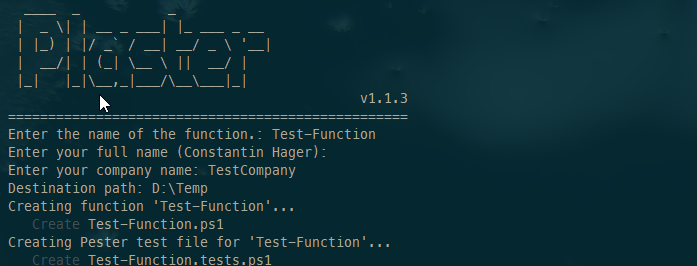
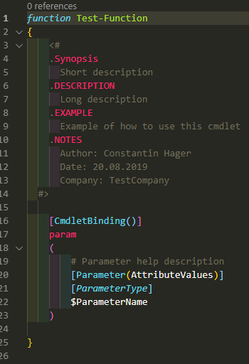
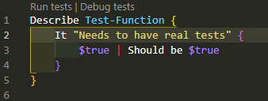

# My PlasterTemplates

Plaster Templates for the following Scaffolding purposes:

- Module
- Function
- Universal Dashboard

# Before using the templates

Install plaster from the PowerShellGallery:

```powershell
Install-Module Plaster -Scope CurrentUser
```

This Module is not yet in the PowerShell Gallery so please clone It or download the Zip.
Copy It in the standard PowerShell Module Path Directories.

If you run

```powershell
Get-PlasterTemplate -IncludeInstalledModules
```

you should see the following output:

```powershell
Title        : AddPSScriptAnalyzerSettings
Author       : Plaster project
Version      : 1.0.0
Description  : Add a PowerShell Script Analyzer settings file to the root of your workspace.
Tags         : {PSScriptAnalyzer, settings}
TemplatePath : xxxx

Title        : New PowerShell Manifest Module
Author       : Plaster
Version      : 1.1.0
Description  : Creates files for a simple, non-shared PowerShell script module.
Tags         : {Module, ScriptModule, ModuleManifest}
TemplatePath : xxxx

Title        : Function
Author       : Constantin Hager
Version      : 1.0.0
Description  : Plaster Manifest for creating PowerShell functions
Tags         : Function
TemplatePath : xxxx

Title        : Module
Author       : Constantin Hager
Version      : 0.1.0
Description  : My sample module Template
Tags         : {Module, Build}
TemplatePath : xxxx

Title        : UniversalDashboard
Author       : Constantin Hager
Version      : 1.0.0
Description  : Template to create an Universal Dashboard Project
Tags         : UniversalDashboard
TemplatePath : xxxx
```

The first two templates came with Plaster and the last three templates are
the templates which came with my Module.

Plaster always needs the full TemplatePath. You can get the path by running the following PowerShell command:

This is an example for the Plaster template UniversalDashboard.

```powershell
$TemplatePath = ((Get-PlasterTemplate -IncludeInstalledModules).where{$_.Title -eq "UniversalDashboard"}).TemplatePath
```

# How to use the Plaster Templates

## Function

This is the easiest Plaster template in this collection. You do not need any prerequisites.

Just ran

```powershell
Invoke-Plaster -TemplatePath $TemplatePath -DestinationPath "Your Destination"
```

You have to answer three questions:

- The name of the function
- The author of the function
- The company where the author works

The screen will look like this:



The File structure should look like this:


If you open your function file the following things are already there:

- The function has the name that you provided earlier.
- Comment based help is added also. In the notes section you will find information
  about the Author, the Date when the function was created and the company that the
  user provided.
- An empty parameter is also added in the template.

The function looks like this:



The second file is the Pester test file for that function.



# Note

This was inspired by the Plaster Project Template [NewModule](https://github.com/PowerShell/Plaster/tree/master/examples/NewModule)
and the Plaster Template Repo by dchristian3188 [PlasterTemplates](https://github.com/dchristian3188/PlasterTemplates)
